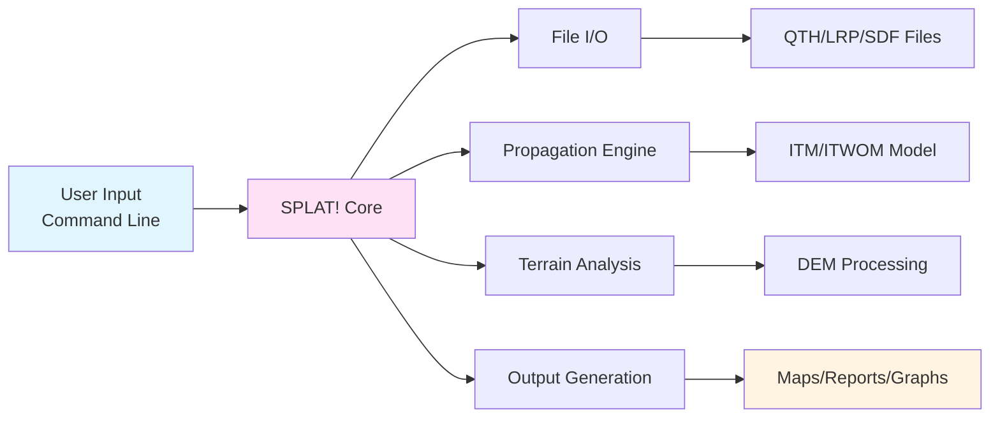
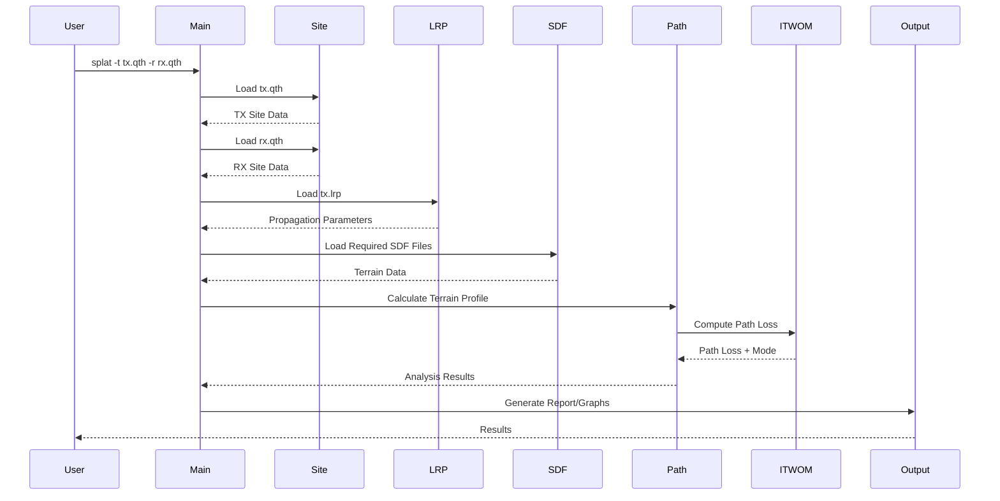
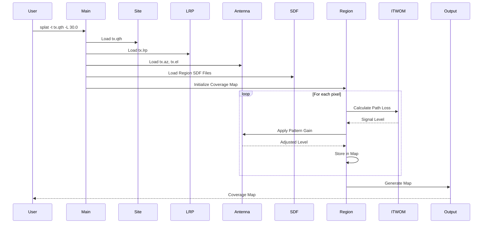
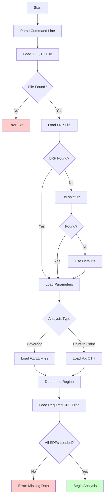
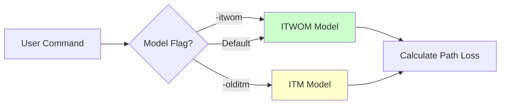
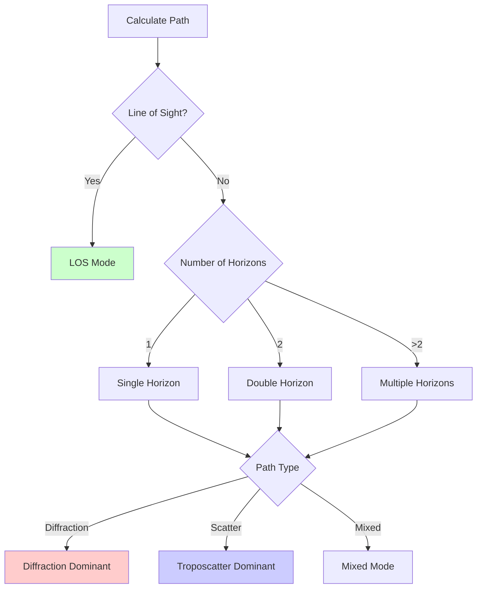
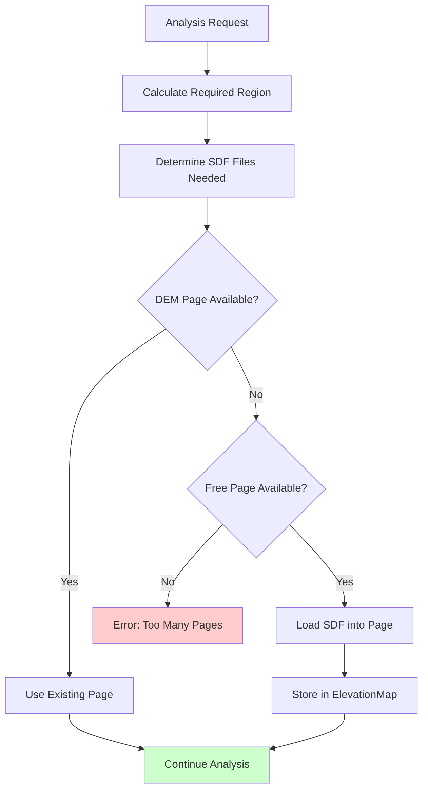
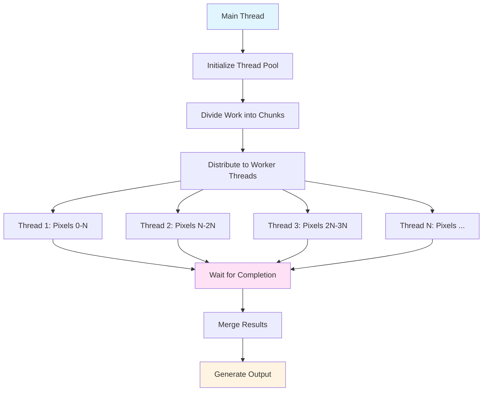
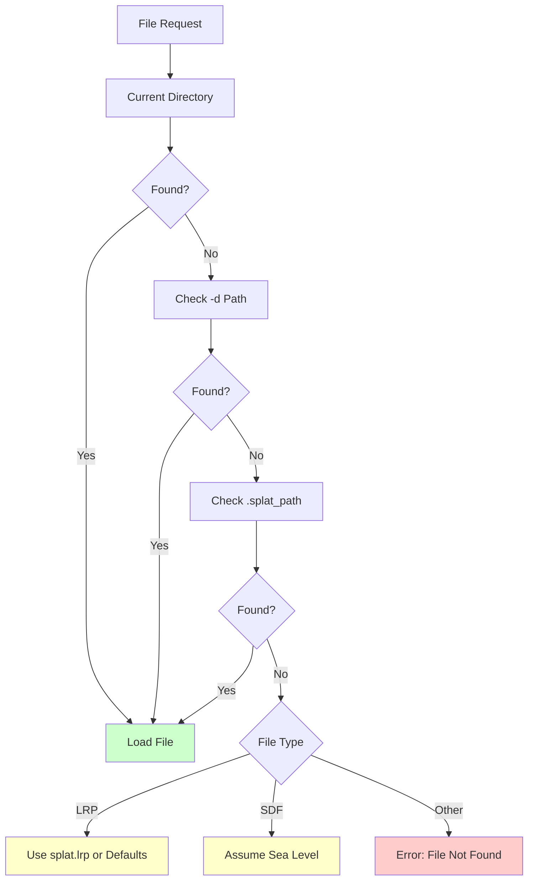
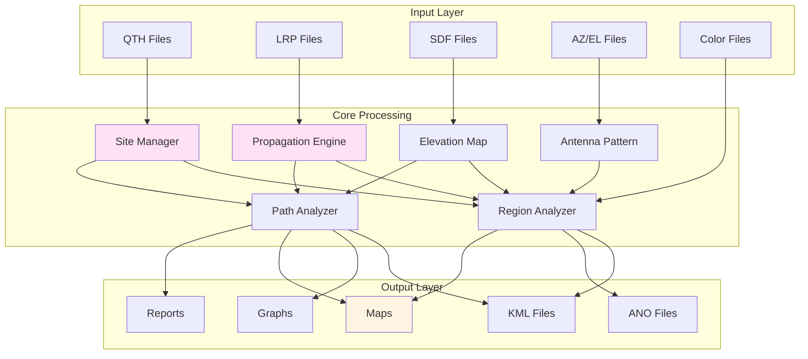

# SPLAT! Architecture and System Overview

This document provides a comprehensive overview of SPLAT!'s architecture, data flow, and internal structure. It complements the [Data File Formats](data_file_formats.md) documentation by explaining how the system processes data and generates results.

## Table of Contents

1. [System Overview](#system-overview)
2. [Core Components](#core-components)
3. [Data Flow](#data-flow)
4. [Propagation Models](#propagation-models)
5. [Analysis Modes](#analysis-modes)
6. [Memory Management](#memory-management)
7. [Multi-threading](#multi-threading)
8. [File I/O](#file-io)

---

## System Overview

SPLAT! is a command-line RF propagation analysis tool that performs terrain-aware signal propagation calculations using the Longley-Rice Irregular Terrain Model (ITM) and ITWOM (ITM With Obstruction Method).



### Key Characteristics

- **Terrain-Based**: Uses digital elevation models (DEMs) for accurate path analysis
- **Statistical Model**: ITM/ITWOM provides probabilistic predictions (F(50,90), etc.)
- **Multi-Mode**: Supports point-to-point, coverage, and path loss analysis
- **High Resolution**: Standard (3 arc-sec) and HD (1 arc-sec) modes
- **Flexible Output**: Maps, graphs, reports, and exportable data

---

## Core Components

### 1. Site Management (`site.h`/`site.cpp`)

Represents geographic locations (transmitter/receiver sites).

**Key Functions**:
- Load QTH files
- Calculate distances and bearings between sites
- Convert between coordinate formats (decimal/DMS)

**Data Structure**:
```cpp
class Site {
    double lat;          // Latitude
    double lon;          // Longitude
    float alt;           // Altitude (AGL or MSL)
    bool amsl_flag;     // MSL vs AGL flag
    std::string name;    // Site name
    std::string filename;// Source filename
}
```

### 2. Elevation Map (`elevation_map.h`/`elevation_map.cpp`)

Manages multiple DEM pages (1°×1° terrain blocks) in memory.

**Key Functions**:
- Load and manage multiple SDF files
- Find elevation at any lat/lon coordinate
- Handle coordinate transformations
- Track min/max elevations

**Data Structure**:
```cpp
class ElevationMap {
    Dem *dem[MAXPAGES];  // Array of DEM pages
    int min_elevation;   // Global minimum
    int max_elevation;   // Global maximum
    // ... boundary tracking
}
```

### 3. DEM (Digital Elevation Model) (`dem.h`/`dem.cpp`)

Represents a single 1°×1° terrain block.

**Key Functions**:
- Store elevation grid data
- Provide elevation lookups
- Track signal/coverage data

**Data Structure**:
```cpp
class Dem {
    int data[IPPD * IPPD];      // Elevation grid
    unsigned char signal[...];  // Signal strength data
    unsigned char mask[...];    // Coverage mask
    int max_west, min_west;     // Boundaries
    int max_north, min_north;
    int max_el, min_el;         // Elevation range
}
```

### 4. SDF Handler (`sdf.h`/`sdf.cpp`)

Loads SPLAT Data Files (terrain elevation data).

**Key Functions**:
- Parse SDF file format
- Handle compressed (.bz2) files
- Load data into DEM structures
- Search file paths

**File Format**:
```
max_west
min_north
min_west
max_north
elevation_grid[1200×1200 or 3600×3600]
```

### 5. LRP Handler (`lrp.h`/`lrp.cpp`)

Manages Longley-Rice Propagation (LRP) Irregular Terrain Model (ITM) parameters.

**Key Functions**:
- Load LRP files
- Validate parameters
- Provide defaults
- Handle ERP overrides

**Parameters**:
- Earth dielectric constant
- Ground conductivity
- Atmospheric bending
- Frequency
- Radio climate
- Polarization
- Statistical parameters (F(50,90))

### 6. Antenna Pattern (`antenna_pattern.h`/`antenna_pattern.cpp`)

Processes azimuth and elevation radiation patterns.

**Key Functions**:
- Load .az and .el files
- Apply pattern rotation and tilt
- Combine azimuth/elevation patterns
- Interpolate missing values

**Data Structure**:
```cpp
class AntennaPattern {
    float antenna_pattern[361][1001];  // 2D pattern array
    bool got_azimuth_pattern;
    bool got_elevation_pattern;
}
```

### 7. Path Analysis (`path.h`/`path.cpp`)

Performs point-to-point terrain and propagation analysis.

**Key Functions**:
- Calculate terrain profile
- Identify obstructions
- Compute path loss
- Determine Fresnel zone clearance

### 8. Region Analysis (`region.h`/`region.cpp`)

Performs area coverage and path loss mapping.

**Key Functions**:
- Generate coverage maps
- Calculate path loss contours
- Apply antenna patterns
- Generate color-coded maps

### 9. ITM/ITWOM Engine (`itwom3.0.cpp`)

Core propagation model implementation.

**Key Functions**:
- Calculate path loss
- Determine propagation mode
- Handle terrain effects
- Apply statistical variations

**Propagation Modes**:
- Line-of-Sight
- Single Horizon
- Double Horizon
- Diffraction Dominant
- Troposcatter Dominant

---

## Data Flow

### Point-to-Point Analysis Flow



### Coverage Analysis Flow



### File Loading Sequence



---

## Propagation Models

### ITM (Irregular Terrain Model)

The original Longley-Rice model, implemented as a statistical prediction method.

**Characteristics**:
- Valid for 20 MHz to 20 GHz
- Accounts for terrain, climate, and frequency
- Provides statistical predictions (F(50,90), etc.)
- Handles multiple propagation modes

### ITWOM (ITM With Obstruction Method)

Enhanced version with improved obstruction handling.

**Improvements**:
- Better handling of receiver at terrain peak
- Improved single/double horizon detection
- More accurate diffraction calculations

### Model Selection



### Propagation Mode Determination



---

## Analysis Modes

### 1. Point-to-Point Analysis

**Purpose**: Analyze signal path between two specific locations.

**Inputs**:
- Transmitter QTH file (`-t`)
- Receiver QTH file (`-r`)
- LRP file (optional, uses defaults if missing)
- SDF files (auto-loaded as needed)

**Outputs**:
- Text report (path analysis)
- Terrain profile graphs (`-p`, `-e`, `-h`, `-H`)
- Path loss graph (`-l`)
- Topographic map (`-o`)
- KML file (`-kml`)

**Process**:
1. Load transmitter and receiver sites
2. Calculate great circle path
3. Extract terrain profile along path
4. Identify obstructions
5. Calculate path loss using ITM/ITWOM
6. Generate reports and visualizations

### 2. Coverage Analysis (`-c`)

**Purpose**: Determine line-of-sight coverage area.

**Inputs**:
- Transmitter QTH file(s) (`-t`, up to 4)
- Receive antenna height (`-c height`)
- SDF files (auto-loaded for region)
- Optional: AZ/EL patterns, city files, boundaries

**Outputs**:
- Coverage map (PNG/JPG/PPM)
- Site report
- Optional: KML file

**Process**:
1. Load transmitter site(s)
2. Determine analysis region
3. Load required SDF files
4. For each pixel in region:
   - Calculate line-of-sight to transmitter
   - Mark as covered if LOS exists
5. Generate color-coded map

### 3. Path Loss Analysis (`-L`)

**Purpose**: Generate path loss, field strength, or power level contours.

**Inputs**:
- Transmitter QTH file(s) (`-t`, up to 30)
- Receive antenna height (`-L height`)
- LRP file (required)
- SDF files (auto-loaded for region)
- Optional: AZ/EL patterns, color files

**Outputs**:
- Path loss/field strength map
- Site report
- Optional: ANO file, KML file

**Process**:
1. Load transmitter site(s) and LRP parameters
2. Determine analysis region
3. Load required SDF files
4. Load antenna patterns (if available)
5. For each pixel in region:
   - Calculate path loss using ITM/ITWOM
   - Apply antenna pattern gain
   - Convert to field strength/power (if ERP specified)
   - Store in coverage map
6. Apply color definitions
7. Generate map

---

## Memory Management

### DEM Page Management

SPLAT! uses a page-based memory system for terrain data:



**Page Limits**:
- Default: 16 pages (1°×1° each)
- Configurable: `-maxpages` switch (1, 4, 9, 16, 25, 36, 49, 64)
- Each page: ~1.4 MB (standard) or ~12.6 MB (HD)

**Memory Calculation**:
- Standard mode: 16 pages × 1.4 MB = ~22 MB (minimum)
- HD mode: 16 pages × 12.6 MB = ~200 MB (minimum)
- Additional memory for signal maps, coverage masks, etc.

### Dynamic Allocation

Modern SPLAT! uses heap allocation instead of fixed-size arrays:

- **Benefits**: Supports variable grid sizes, better memory utilization
- **Flexibility**: Can adjust to available system memory
- **Safety**: Graceful error handling when memory is insufficient

---

## Multi-threading

SPLAT! supports multi-threaded processing for coverage and path loss maps.

### Threading Model



### Thread Safety

- **ITWOM Model**: Made reentrant (no static variables)
- **DEM Access**: Read-only during analysis (safe for concurrent access)
- **Output Buffers**: Per-thread storage, merged at end

### Performance

- **Default**: Multi-threaded (uses all CPU cores)
- **Override**: `-st` for single-threaded (classic mode)
- **Speedup**: Typically 4-8× on modern multi-core systems

---

## File I/O

### File Search Strategy



### Compression Support

- **SDF Files**: Automatic bzip2 decompression
- **Search Order**: Uncompressed first, then compressed
- **Transparency**: Application doesn't need to know compression status

### File Format Parsing

- **ASCII Text**: All input files are text-based
- **Comment Support**: Lines starting with `;` or text after `;` ignored
- **Flexible Parsing**: Handles whitespace, optional fields, DMS coordinates

---

## Component Interaction Diagram



---

## Performance Considerations

### Computational Complexity

- **Point-to-Point**: O(1) - Single path calculation
- **Coverage Map**: O(N²) where N = pixels per side
  - Standard: 1200² = 1.44M pixels
  - HD: 3600² = 12.96M pixels
- **Path Loss Map**: O(N² × M) where M = ITM calculation complexity

### Optimization Strategies

1. **Multi-threading**: Parallel pixel processing
2. **SDF Caching**: Keep frequently-used terrain in memory
3. **Range Limiting**: `-R` and `-db` switches reduce computation
4. **ANO Export/Import**: Pre-compute path loss, apply patterns later

### Typical Performance

- **Point-to-Point**: < 1 second
- **Coverage Map** (standard): 10-60 seconds (depending on region size)
- **Path Loss Map** (standard): 1-10 minutes (depending on region size)
- **HD Mode**: 3-9× longer due to 9× more pixels

---

## Error Handling

### File Errors

- **Missing Required Files**: Error message, exit
- **Missing Optional Files**: Use defaults, continue
- **Invalid Format**: Error message, use defaults if possible

### Calculation Errors

- **Invalid Coordinates**: Range checking, error message
- **Memory Exhaustion**: Graceful error, suggest reducing `-maxpages`
- **ITM Errors**: Fallback to simpler calculations when possible

### User Feedback

- **Progress Indicators**: File loading messages
- **Error Messages**: Clear, actionable error descriptions
- **Warnings**: Non-fatal issues (missing optional files, etc.)

---

*Last Updated: 2025*

