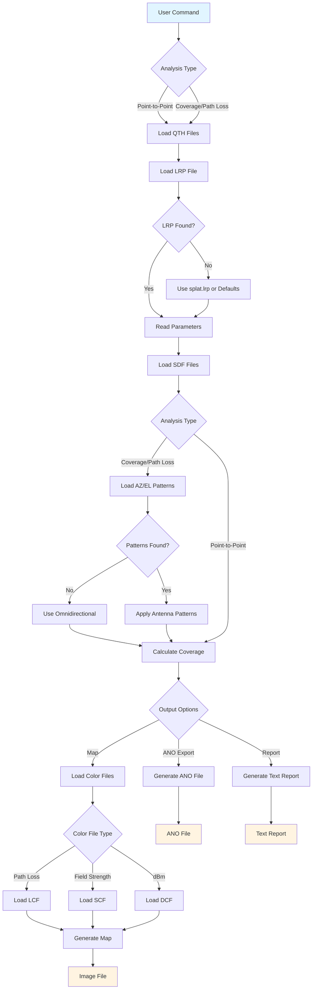

# SPLAT! Data File Formats

This document provides a comprehensive guide to all data file formats used by SPLAT! (Signal Propagation, Loss, And Terrain analysis tool). Understanding these formats is essential for creating input files, interpreting output, and customizing SPLAT! analyses.

## Table of Contents

1. [Overview](#overview)
2. [Required Files](#required-files)
   - [QTH Files (Site Location)](#qth-files-site-location)
   - [LRP Files (Irregular Terrain Model Parameters)](#lrp-files-irregular-terrain-model-parameters)
   - [SDF Files (SPLAT Data Files)](#sdf-files-splat-data-files)
3. [Optional Files](#optional-files)
   - [AZ Files (Azimuth Antenna Patterns)](#az-files-azimuth-antenna-patterns)
   - [EL Files (Elevation Antenna Patterns)](#el-files-elevation-antenna-patterns)
   - [Color Definition Files](#color-definition-files)
     - [LCF Files (Path Loss Color Definition)](#lcf-files-path-loss-color-definition)
     - [SCF Files (Signal Strength Color Definition)](#scf-files-signal-strength-color-definition)
     - [DCF Files (dBm Color Definition)](#dcf-files-dbm-color-definition)
4. [Output Files](#output-files)
   - [ANO Files (Alphanumeric Output)](#ano-files-alphanumeric-output)
5. [File Naming Conventions](#file-naming-conventions)
6. [Data Flow Diagram](#data-flow-diagram)

---

## Overview

SPLAT! uses a variety of ASCII text files for input and output. These files fall into three categories:

- **Required Files**: Must be present for SPLAT! to function
- **Optional Files**: Enhance analysis with additional data
- **Output Files**: Generated by SPLAT! for further processing

All files use ASCII text encoding and support comments (lines starting with `;` or text after `;` on a line).

---

## Required Files

### QTH Files (Site Location)

**Extension**: `.qth`  
**Purpose**: Defines the geographic location and antenna height of transmitter or receiver sites.

**File Structure**:
```
Site Name
Latitude
Longitude
Antenna Height [units]
[Optional: MSL or AGL]
```

**Field Descriptions**:

1. **Site Name** (Line 1): A descriptive name for the site (e.g., "WNJT-DT", "Repeater Site 1")
   - Can contain spaces and special characters
   - Used in reports and output files

2. **Latitude** (Line 2): Geographic latitude in decimal degrees or DMS format
   - **Decimal format**: `40.2828` (positive = North, negative = South)
   - **DMS format**: `40 48 8.0` (degrees minutes seconds)
   - Range: -90.0 to +90.0

3. **Longitude** (Line 3): Geographic longitude in decimal degrees or DMS format
   - **Decimal format**: `74.6864` (degrees West: 0-360, or degrees East: 0 to -360)
   - **DMS format**: `74 14 47.0` (degrees minutes seconds)
   - Range: 0-360 (West) or 0 to -360 (East)

4. **Antenna Height** (Line 4): Height of antenna above ground level (AGL) or mean sea level (MSL)
   - **Default units**: Feet (if no unit specified)
   - **Metric units**: Add `m` or `meters` after the number
   - Examples: `990.00`, `98.5 meters`, `300.0 m`

5. **Reference Level** (Line 5, Optional): Specifies whether height is AGL or MSL
   - `AGL` = Above Ground Level (default if omitted)
   - `MSL` = Mean Sea Level

**Example QTH File** (`wnju-dt.qth`):
```
WNJU-DT
40 48 8.0
74 14 47.0
98.5 meters
```

**Example with MSL**:
```
Mountain Top Repeater
40.2828
-74.6864
1200.0
MSL
```

**Notes**:
- Each transmitter and receiver site requires its own QTH file
- QTH files are referenced by their base name (without extension) in SPLAT! commands
- The file name typically matches the site name for clarity (e.g., `wnju-dt.qth`)

---

### LRP Files (Irregular Terrain Model Parameters)

**Extension**: `.lrp`  
**Purpose**: Defines propagation model parameters for the Longley-Rice ITM/ITWOM model.

**File Structure**:
```
Earth Dielectric Constant
Earth Conductivity
Atmospheric Bending Constant
Frequency
Radio Climate
Polarization
Fraction of Situations
Fraction of Time
[Optional: Effective Radiated Power]
```

**Field Descriptions**:

1. **Earth Dielectric Constant** (Line 1): Relative permittivity of the ground
   - Typical values: 4-80
   - Common values:
     - Salt water: 80
     - Fresh water: 80
     - Good ground: 25
     - Average ground: 15
     - City: 5
     - Poor ground: 4

2. **Earth Conductivity** (Line 2): Ground conductivity in Siemens per meter
   - Typical range: 0.001 to 5.000
   - Common values:
     - Salt water: 5.000
     - Good ground: 0.020
     - Fresh water: 0.010
     - Marshy land: 0.007
     - Farmland/forest: 0.005
     - Average ground: 0.005
     - Mountain/sand: 0.002
     - City: 0.001
     - Poor ground: 0.001

3. **Atmospheric Bending Constant** (Line 3): Atmospheric refractivity in N-units
   - Typical value: 301.0 (standard atmosphere)
   - Range: 250-400
   - Lower values = less bending (more line-of-sight)
   - Higher values = more bending (extended range)

4. **Frequency** (Line 4): Operating frequency in MHz
   - Range: 20 MHz to 20 GHz
   - Must match the actual transmission frequency

5. **Radio Climate** (Line 5): Integer code for propagation environment
   - `1` = Equatorial (Congo)
   - `2` = Continental Subtropical (Sudan)
   - `3` = Maritime Subtropical (West coast of Africa)
   - `4` = Desert (Sahara)
   - `5` = Continental Temperate (most of USA, Europe)
   - `6` = Maritime Temperate, over land (UK, west coasts of US & EU)
   - `7` = Maritime Temperate, over sea

6. **Polarization** (Line 6): Antenna polarization
   - `0` = Horizontal
   - `1` = Vertical

7. **Fraction of Situations** (Line 7): Location variability (0.0 to 1.0)
   - Also called "confidence" or "location variability"
   - `0.50` = 50% of locations (median)
   - Common values: 0.50, 0.90
   - Higher values = more conservative (higher path loss)

8. **Fraction of Time** (Line 8): Time variability (0.0 to 1.0)
   - Also called "reliability" or "time variability"
   - `0.90` = 90% of the time
   - Common values: 0.50, 0.90
   - Higher values = more conservative (higher path loss)
   - **F(50,90)** = 50% of locations, 90% of time (common for digital TV)
   - **F(50,50)** = 50% of locations, 50% of time (common for analog TV)

9. **Effective Radiated Power** (Line 9, Optional): Transmitter ERP in Watts
   - If omitted or zero: SPLAT! calculates path loss only
   - If specified: SPLAT! calculates field strength (dBuV/m) and received power
   - Can be overridden with `-erp` command-line switch
   - Can specify in dBm by adding "dBm" suffix (e.g., `47 dBm`)

**Example LRP File** (`wnju-dt.lrp`):
```
15.000	; Earth Dielectric Constant (Relative permittivity)
0.005	; Earth Conductivity (Siemens per meter)
301.000	; Atmospheric Bending Constant (N-Units)
605.000	; Frequency in MHz (20 MHz to 20 GHz)
5	; Radio Climate
0	; Polarization (0 = Horizontal, 1 = Vertical)
0.50	; Fraction of situations
0.90	; Fraction of time
650000  ; ERP in watts
```

**File Naming**:
- Must have the same base name as the corresponding QTH file
- Example: `wnju-dt.qth` → `wnju-dt.lrp`
- If not found, SPLAT! looks for `splat.lrp` in the current directory
- If `splat.lrp` doesn't exist, SPLAT! creates one with default values

**Comments**:
- Lines starting with `;` are ignored
- Text after `;` on a line is treated as a comment
- Comments are preserved when SPLAT! auto-generates files

---

### SDF Files (SPLAT Data Files)

**Extension**: `.sdf` or `.sdf.bz2`  
**Purpose**: Contains digital elevation model (DEM) data for terrain analysis.

**File Structure**:
```
max_west
min_north
min_west
max_north
elevation_data[0][0]
elevation_data[0][1]
...
elevation_data[ippd-1][ippd-1]
```

**Field Descriptions**:

1. **max_west** (Line 1): Maximum (westernmost) longitude of the data block
   - In degrees West (0-360)

2. **min_north** (Line 2): Minimum (southernmost) latitude of the data block
   - In degrees North (-90 to +90)

3. **min_west** (Line 3): Minimum (easternmost) longitude of the data block
   - In degrees West (0-360)

4. **max_north** (Line 4): Maximum (northernmost) latitude of the data block
   - In degrees North (-90 to +90)

5. **Elevation Data** (Lines 5+): Grid of elevation values
   - **Standard mode**: 1200 × 1200 pixels (3 arc-second resolution)
   - **HD mode**: 3600 × 3600 pixels (1 arc-second resolution)
   - Each value is an integer representing elevation in meters above sea level
   - Data is stored row by row (x from 0 to ippd-1, y from 0 to ippd-1)
   - Format: One integer per line

**File Naming Convention**:
- Standard format: `N{lat}W{lon}.sdf` or `N{lat}W{lon}_hd.sdf` (HD mode)
- Example: `N40W074.sdf` (covers 40°N to 41°N, 74°W to 73°W)
- Alternative format: `{lat}_{lon}.sdf` (using delimiter specified by `-sdelim` switch)
- The filename refers to the **southwest corner** of the 1°×1° block

**Compression**:
- SDF files can be compressed with bzip2: `N40W074.sdf.bz2`
- SPLAT! automatically searches for uncompressed files first, then compressed
- Compressed files are smaller but slightly slower to read

**Data Sources**:
- **USGS DEM**: Generated using `usgs2sdf` utility
- **SRTM-3**: Generated using `srtm2sdf` utility (3 arc-second, standard mode)
- **SRTM-1**: Generated using `srtm2sdf-hd` utility (1 arc-second, HD mode)

**Resolution**:
- **Standard mode**: 3 arc-seconds ≈ 90 meters at equator
- **HD mode**: 1 arc-second ≈ 30 meters at equator
- Each SDF file covers exactly 1 degree latitude × 1 degree longitude

**Missing Data**:
- If an SDF file is missing, SPLAT! assumes sea level (0 meters) for that region
- This allows analysis over coastal areas and water
- Voids in SRTM data are filled from USGS data or adjacent pixel averaging

**Example SDF File Structure** (conceptual):
```
74.0     ; max_west
40.0     ; min_north
73.0     ; min_west
41.0     ; max_north
125      ; elevation at (0,0) in meters
127      ; elevation at (0,1)
...
```

**Notes**:
- SDF files are large: ~1.4 MB uncompressed (standard), ~12.6 MB (HD)
- Compressed files are typically 30-50% of original size
- Multiple SDF files are loaded automatically as needed for the analysis region
- Files are stored in memory as DEM (Digital Elevation Model) structures

---

## Optional Files

### AZ Files (Azimuth Antenna Patterns)

**Extension**: `.az`  
**Purpose**: Defines the horizontal (azimuth) radiation pattern of the transmitting antenna.

**File Structure**:
```
azimuth_rotation
azimuth_0 normalized_pattern_0
azimuth_1 normalized_pattern_1
...
azimuth_360 normalized_pattern_360
```

**Field Descriptions**:

1. **Azimuth Rotation** (Line 1): Pattern rotation in degrees clockwise from True North
   - Range: 0.0 to 360.0
   - Used to orient the pattern (e.g., if antenna is physically rotated)
   - Example: `183.0` rotates pattern 183° clockwise

2. **Azimuth/Pattern Pairs** (Lines 2+): Azimuth angle and normalized field pattern
   - **Azimuth**: Degrees from 0 to 360 (can be fractional)
   - **Normalized Pattern**: Field strength relative to maximum (0.000 to 1.000)
   - Values are separated by whitespace (space or tab)
   - **Resolution**: Best results with 1-degree resolution (0, 1, 2, ..., 360)
   - SPLAT! interpolates missing values if resolution is coarser

**Normalized Pattern Values**:
- `1.000` = Maximum radiation (typically at 0° or main lobe direction)
- `0.500` = Half power (-3 dB)
- `0.000` = Null (no radiation)
- Values represent **voltage** (field strength), not power
- Power = voltage², so 0.5 voltage = 0.25 power = -6 dB

**Example AZ File** (`wnju-dt.az`):
```
0
0	0.49
1       0.5
2       0.51
...
108     1
109     1
110     1
...
359     0.48
360     0.49
```

**File Naming**:
- Must have the same base name as the QTH/LRP files
- Example: `wnju-dt.qth` → `wnju-dt.az`
- If not found, SPLAT! assumes omnidirectional pattern (1.0 at all azimuths)

**Interpolation**:
- SPLAT! automatically interpolates missing azimuth values
- Handles 0°=360° ambiguity automatically
- Averages multiple values if same azimuth appears multiple times

**Usage**:
- Used only for regional coverage analysis (`-c` or `-L` switches)
- Not used for point-to-point analysis
- Combined with elevation pattern (`.el` file) to create 3D radiation pattern

---

### EL Files (Elevation Antenna Patterns)

**Extension**: `.el`  
**Purpose**: Defines the vertical (elevation) radiation pattern of the transmitting antenna.

**File Structure**:
```
mechanical_tilt tilt_azimuth
elevation_angle_0 normalized_pattern_0
elevation_angle_1 normalized_pattern_1
...
elevation_angle_N normalized_pattern_N
```

**Field Descriptions**:

1. **Mechanical Tilt** (Line 1, first value): Physical antenna downtilt in degrees
   - **Positive values** = Downward tilt (below horizon)
   - **Negative values** = Upward tilt (above horizon)
   - Range: Typically -5° to +10°
   - Example: `1.1` = 1.1° downward tilt

2. **Tilt Azimuth** (Line 1, second value): Direction of mechanical tilt
   - Degrees clockwise from True North (0-360)
   - Example: `130.0` = tilt toward 130° azimuth

3. **Elevation/Pattern Pairs** (Lines 2+): Elevation angle and normalized field pattern
   - **Elevation**: Degrees from -10.0 to +90.0
   - **Negative angles** = Above horizon (uptilt)
   - **Positive angles** = Below horizon (downtilt)
   - **Normalized Pattern**: Field strength (0.000 to 1.000)
   - **Resolution**: Best results with 0.01-degree resolution
   - SPLAT! interpolates missing values

**Elevation Angle Convention**:
- `-10.0°` to `0.0°`: Above horizon (typical main lobe)
- `0.0°`: Horizon
- `0.0°` to `+90.0°`: Below horizon

**Example EL File** (`wnju-dt.el`):
```
 0.0	0.0
-10	0.04
-9.5    0.06
-9      0.12
...
0       0.94
0.2     0.98
0.4     1
0.6     1
...
90      0
```

**File Naming**:
- Must have the same base name as the QTH/LRP files
- Example: `wnju-dt.qth` → `wnju-dt.el`
- If not found, SPLAT! assumes uniform pattern (1.0 at all elevations)

**Combined Pattern**:
- Azimuth and elevation patterns are multiplied together
- Final pattern = `az_pattern[azimuth] × el_pattern[elevation]`
- Mechanical tilt is applied as a coordinate transformation

**Usage**:
- Used only for regional coverage analysis (`-c` or `-L` switches)
- Critical for accurate coverage prediction with directional antennas
- Accounts for antenna gain variation with elevation angle

---

### Color Definition Files

SPLAT! uses three types of color definition files to customize the appearance of coverage maps. These files define RGB colors for different signal level ranges.

#### LCF Files (Path Loss Color Definition)

**Extension**: `.lcf`  
**Purpose**: Defines colors for path loss contours (used when ERP is not specified or is zero).

**File Structure**:
```
; Comments allowed
dB_threshold_0: red_0, green_0, blue_0
dB_threshold_1: red_1, green_1, blue_1
...
```

**Field Descriptions**:

- **dB Threshold**: Path loss in decibels (positive values, typically 80-230)
- **RGB Values**: Red, green, blue components (0-255 each)
- **Format**: `dB: red, green, blue` (colon and commas required)

**Color Assignment**:
- If path loss < first threshold: Use first color
- If path loss ≥ threshold_N but < threshold_N+1: Use color N+1
- If path loss ≥ last threshold: Display greyscale terrain only

**Example LCF File** (`wnju-dt.lcf`):
```
; SPLAT! Auto-generated Path-Loss Color Definition File
;
; Format: dB: red, green, blue
;
 80: 255,   0,   0    ; Red (excellent)
 90: 255, 128,   0    ; Orange
100: 255, 165,   0    ; Dark Orange
110: 255, 206,   0    ; Yellow-Orange
120: 255, 255,   0    ; Yellow
130: 184, 255,   0    ; Yellow-Green
140:   0, 255,   0    ; Green (good)
150:   0, 208,   0    ; Dark Green
160:   0, 196, 196    ; Cyan
170:   0, 148, 255    ; Light Blue
180:  80,  80, 255    ; Blue
190:   0,  38, 255    ; Dark Blue
200: 142,  63, 255    ; Purple
210: 196,  54, 255    ; Magenta
220: 255,   0, 255    ; Bright Magenta
230: 255, 194, 204    ; Pink (poor)
```

**File Naming**:
- Must have the same base name as the QTH file
- Example: `wnju-dt.qth` → `wnju-dt.lcf`
- If not found, SPLAT! auto-generates with default colors

**Limitations**:
- Maximum 32 contour regions
- Thresholds should be in ascending order

---

#### SCF Files (Signal Strength Color Definition)

**Extension**: `.scf`  
**Purpose**: Defines colors for field strength contours in dBuV/m (used when ERP is specified).

**File Structure**:
```
; Comments allowed
dBuV_per_m_threshold_0: red_0, green_0, blue_0
dBuV_per_m_threshold_1: red_1, green_1, blue_1
...
```

**Field Descriptions**:

- **dBuV/m Threshold**: Field strength in decibels over 1 microvolt per meter
- **RGB Values**: Red, green, blue components (0-255 each)
- **Format**: `dBuV/m: red, green, blue`

**Typical Thresholds** (for UHF TV):
- `128 dBuV/m`: City Grade +60 dB (excellent)
- `118 dBuV/m`: City Grade +50 dB
- `108 dBuV/m`: City Grade +40 dB
- `98 dBuV/m`: City Grade +30 dB
- `88 dBuV/m`: City Grade +20 dB
- `78 dBuV/m`: City Grade +10 dB
- `68 dBuV/m`: City Grade
- `58 dBuV/m`: Grade A
- `48 dBuV/m`: Service Threshold (DTV)
- `41 dBuV/m`: Minimum Service Threshold (DTV)

**Example SCF File** (`wnju-dt.scf`):
```
; SPLAT! Auto-generated Signal Color Definition File
;
; Format: dBuV/m: red, green, blue
;
108: 255,   0,   0    ; City Grade +60dB
 98: 255, 165,   0    ; City Grade +50dB
 88: 255, 206,   0    ; City Grade +40dB
 78: 255, 255,   0    ; City Grade +30dB
 68: 184, 255,   0    ; City Grade +20dB
 58:   0, 255,   0    ; City Grade +10dB
 48:   0, 208,   0    ; City Grade
 41:   0, 196, 196    ; Service Threshold
```

**File Naming**:
- Must have the same base name as the QTH file
- Example: `wnju-dt.qth` → `wnju-dt.scf`
- If not found, SPLAT! auto-generates with default colors

---

#### DCF Files (dBm Color Definition)

**Extension**: `.dcf`  
**Purpose**: Defines colors for received power level contours in dBm (used with `-dbm` switch).

**File Structure**:
```
; Comments allowed
dBm_threshold_0: red_0, green_0, blue_0
dBm_threshold_1: red_1, green_1, blue_1
...
```

**Field Descriptions**:

- **dBm Threshold**: Received power in decibels over 1 milliwatt
- **Range**: +40 dBm to -200 dBm
- **RGB Values**: Red, green, blue components (0-255 each)
- **Format**: `dBm: red, green, blue` (can use `+` or `-` sign)

**Example DCF File** (`wnju-dt.dcf`):
```
; SPLAT! Auto-generated DBM Signal Level Color Definition File
;
; Format: dBm: red, green, blue
;
  +0: 255,   0,   0    ; +0 dBm (excellent)
 -10: 255, 128,   0    ; -10 dBm
 -20: 255, 165,   0    ; -20 dBm
 -30: 255, 206,   0    ; -30 dBm
 -40: 255, 255,   0    ; -40 dBm
 -50: 184, 255,   0    ; -50 dBm
 -60:   0, 255,   0    ; -60 dBm
 -70:   0, 208,   0    ; -70 dBm
 -80:   0, 196, 196    ; -80 dBm
 -90:   0, 148, 255    ; -90 dBm
-100:  80,  80, 255    ; -100 dBm
-110:   0,  38, 255    ; -110 dBm
-120: 142,  63, 255    ; -120 dBm
-130: 196,  54, 255    ; -130 dBm
-140: 255,   0, 255    ; -140 dBm
-150: 255, 194, 204    ; -150 dBm (poor)
```

**File Naming**:
- Must have the same base name as the QTH file
- Example: `wnju-dt.qth` → `wnju-dt.dcf`
- If not found, SPLAT! auto-generates with default colors

---

## Output Files

### ANO Files (Alphanumeric Output)

**Extension**: `.ano` (when generated), `.ani` (when imported)  
**Purpose**: Exports/imports contour data for post-processing and antenna pattern integration.

**File Structure**:
```
max_west, min_west    ; Boundary comment
max_north, min_north  ; Boundary comment
latitude_0, longitude_0, azimuth_0, elevation_0, signal_level_0 [*]
latitude_1, longitude_1, azimuth_1, elevation_1, signal_level_1 [*]
...
```

**Field Descriptions**:

1. **Boundary Lines** (Lines 1-2): Define the geographic extent
   - Line 1: `max_west, min_west` (longitude boundaries)
   - Line 2: `max_north, min_north` (latitude boundaries)
   - Format: `value1, value2    ; comment`

2. **Data Lines** (Lines 3+): Per-pixel signal data
   - **Latitude**: Degrees North (decimal)
   - **Longitude**: Degrees West (decimal)
   - **Azimuth**: Bearing from transmitter to this point (degrees, True North)
   - **Elevation**: Elevation angle to receiver/obstruction (degrees)
     - Negative = above horizon
     - Positive = below horizon
     - If path is obstructed, this is elevation to first obstruction
   - **Signal Level**: Depends on analysis mode:
     - Path loss in dB (if no ERP specified)
     - Field strength in dBuV/m (if ERP specified, no `-dbm`)
     - Power level in dBm (if `-dbm` switch used)
   - **Asterisk** (`*`): Optional marker indicating obstructed path
     - If present: Path is blocked, elevation refers to obstruction
     - If absent: Line-of-sight path exists

**Example ANO File** (`pathloss.ano`):
```
119, 117    ; max_west, min_west
35, 34      ; max_north, min_north
34.2265424, 118.0631096, 48.199, -32.747, 67.70
34.2270358, 118.0624421, 48.199, -19.161, 73.72
34.2275292, 118.0617747, 48.199, -13.714, 77.24
34.2280226, 118.0611072, 48.199, -10.508, 79.74
34.2290094, 118.0597723, 48.199, -11.806, 83.26 *
34.2295028, 118.0591048, 48.199, -11.806, 135.47 *
```

**Generating ANO Files**:
```bash
splat -t tx_site -L 30.0 -R 50.0 -db 140 -ano pathloss.dat
```

**Importing ANO Files**:
```bash
splat -t tx_site -ani pathloss.dat -s cities.dat -o map.png
```

**Important Notes**:
- ANO files can be **very large** (hundreds of megabytes)
- Data is **without antenna pattern effects** (isotropic assumed)
- Only the **last column** (signal level) should be modified when applying antenna patterns
- Standard and HD mode ANO files are **incompatible**
- Path loss, field strength, and dBm ANO files are **incompatible** with each other
- Use same command-line options (`-erp`, `-dbm`) when importing as when exporting

**Post-Processing Workflow**:
1. Generate ANO file with `-ano` switch
2. Modify signal levels based on antenna pattern (multiply by pattern gain)
3. Import modified ANO file with `-ani` switch
4. Generate final map

---

## File Naming Conventions

SPLAT! uses a consistent naming convention where related files share the same base name:

```
site_name.qth    → Site location (required)
site_name.lrp    → Propagation parameters (required)
site_name.az     → Azimuth pattern (optional)
site_name.el     → Elevation pattern (optional)
site_name.lcf    → Path loss colors (optional)
site_name.scf    → Signal strength colors (optional)
site_name.dcf    → dBm colors (optional)
```

**Examples**:
- `wnju-dt.qth`, `wnju-dt.lrp`, `wnju-dt.az`, `wnju-dt.el`
- `repeater1.qth`, `repeater1.lrp`
- `tx_site.qth`, `tx_site.lrp`, `tx_site.scf`

**File Search Order**:
1. Current working directory
2. Directory specified by `-d` switch
3. Directory specified in `$HOME/.splat_path` file
4. For LRP files: Falls back to `splat.lrp` if site-specific file not found

---

## Data Flow Diagram

The following diagram illustrates how SPLAT! processes input files and generates output:



---

## File Format Summary Table

| File Type | Extension | Required | Purpose | Size Range |
|-----------|-----------|----------|---------|------------|
| Site Location | `.qth` | Yes | Geographic coordinates | < 1 KB |
| ITM Parameters | `.lrp` | Yes | Propagation model | < 1 KB |
| Elevation Data | `.sdf` | Yes | Terrain elevation | 1-15 MB |
| Azimuth Pattern | `.az` | No | Horizontal antenna pattern | 1-10 KB |
| Elevation Pattern | `.el` | No | Vertical antenna pattern | 5-20 KB |
| Path Loss Colors | `.lcf` | No | Map color scheme | < 1 KB |
| Signal Colors | `.scf` | No | Map color scheme | < 1 KB |
| dBm Colors | `.dcf` | No | Map color scheme | < 1 KB |
| Alphanumeric Output | `.ano`/`.ani` | No | Export/import data | 1-1000 MB |

---

## Additional Resources

- **Main Documentation**: See `docs/manual/english/splat.md` for complete SPLAT! usage guide
- **Utilities**: See `utils/README.md` for SDF file generation utilities
- **Sample Data**: See `sample_data/` directory for example files
- **ITM Model**: Refer to NTIA/ITS documentation for propagation model details

---

## Troubleshooting

### Common Issues

1. **File Not Found Errors**
   - Check file naming (must match base name of QTH file)
   - Verify file is in current directory or path specified by `-d`
   - Check file extensions (case-sensitive on some systems)

2. **Invalid Format Errors**
   - Ensure numeric values are valid (no letters in numeric fields)
   - Check for missing required fields
   - Verify coordinate ranges (latitude: -90 to +90, longitude: 0-360)

3. **Large ANO Files**
   - Use `-db` switch to limit analysis range
   - Consider using `-R` to restrict geographic area
   - Compress files with gzip/bzip2 for storage

4. **Color File Not Applied**
   - Verify file naming matches QTH file base name
   - Check that correct file type is used (LCF vs SCF vs DCF)
   - Ensure file is in current working directory

---

*Last Updated: 2025*

